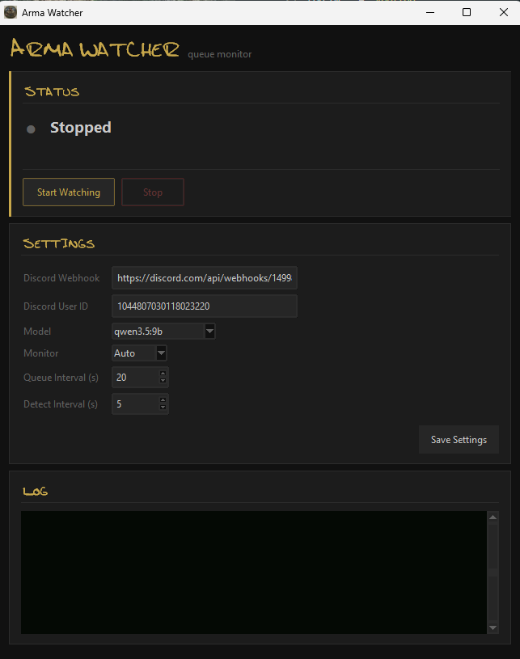

# Arma Watcher

Watches your Arma Reforger screen, detects when you enter a server queue, and sends Discord notifications with your position and estimated wait time — so you can alt-tab away and get pinged when you're about to be in.

It reads the screen with a **local vision model via [Ollama](https://ollama.com)**. No cloud API, no account, no API key. Your screenshots never leave your machine — they're only handed to Ollama running locally.

> _Not affiliated with or endorsed by Bohemia Interactive. "Arma Reforger" is a trademark of its respective owner._



---

## Requirements

- Windows 10/11, or Linux / macOS (run from source — see *Manual* below)
- A GPU with at least **1 GB VRAM** (6.6 GB recommended for the default model)
- Arma Reforger running on any connected monitor
- *(Optional)* A Discord webhook URL for notifications

> **Heads up — VRAM is freed once you're in the game.** As soon as the watcher
> determines you've made it into the match, it kills the Ollama process to free up
> your VRAM for Arma. LLMs are non-deterministic, though, so on rare occasions this
> detection can miss and Ollama may keep running — if you notice stuttering, just
> tell the watcher to stop watching.

---

## Install

### Easiest — one-click installer

1. Go to the [**download page**](https://kent-orr.github.io/arma_watcher/) (or grab `ArmaWatcherSetup.exe` from the [latest release](https://github.com/kent-orr/arma_watcher/releases/latest)).
2. Run **`ArmaWatcherSetup.exe`** and follow the prompts. Windows SmartScreen may warn on a new publisher — choose *More info → Run anyway*.

The installer copies the app, installs everything it needs (uv, Python, Ollama, dependencies), and creates Desktop + Start Menu shortcuts. No command line, no admin required.

### Manual — from source

1. Download this repository (green **Code → Download ZIP** button, then unzip) or `git clone` it.
2. Open the **`launchers`** folder and double-click **`install.bat`** (right-click → *Run as administrator* if you hit permission errors).

The installer automatically:

| Step | What it does |
|---|---|
| **uv** | Installs [uv](https://astral.sh/uv/), the Python package manager, if missing. |
| **Python** | uv fetches the correct Python version for you. |
| **Ollama** | Installs [Ollama](https://ollama.com) if missing — it runs the local vision model. |
| **Dependencies** | `uv sync` installs the Python packages into an isolated environment inside the folder. |
| **Desktop shortcut** | Creates an **Arma Watcher** shortcut that opens the app. |

That's it — no command line needed.

### Linux / macOS — from source

```bash
git clone https://github.com/kent-orr/arma_watcher.git
cd arma_watcher
./launchers/install.sh   # installs uv, Python, Ollama, deps + a desktop entry
./launchers/run.sh       # launch the GUI (or run it from your applications menu)
```

`launchers/install.sh` does the same steps as the Windows installer and adds an **Arma
Watcher** entry to your applications menu. uv's bundled Python ships its own
Tk, so you usually don't need a system `python3-tk`; under Wayland, screen
capture goes through XWayland. Ollama install is optional if you use cloud mode.

---

## Use

Double-click the **Arma Watcher** desktop shortcut. The app opens with three panels:

**1. Settings** — fill these in once and click **Save Settings**:

| Field | Notes |
|---|---|
| Discord Webhook | *(optional)* Channel → Settings → Integrations → Webhooks → New Webhook → Copy URL. Leave blank to disable notifications. |
| Discord User ID | *(optional)* Enable Developer Mode, right-click your name → Copy User ID. Used to `@mention` you. |
| Model | Pick the largest that fits your GPU (see VRAM table below). Default `qwen3.5:9b`. |
| Monitor | `Auto` scans all monitors for Arma. Or pin a specific display number. |
| Queue Interval (s) | How often to re-check your position once queued. Default 20. |
| Detect Interval (s) | How often to look for Arma / a queue before one is found. Default 5. |

**2. Status** — click **Start Watching**. The first time you start, if the selected model isn't downloaded yet the app pulls it automatically (several GB — this can take a few minutes; progress shows in the log). After that, it watches for the queue and shows your live position and ETA.

**3. Log** — a running feed of what the watcher sees:

```
[21:45:46] Discord webhook OK.
[21:46:09] Waiting for queue...
[21:46:21] Position: 47 | My Server | Rate: -- | ETA: --
[21:47:21] Position: 43 | My Server | Rate: 4.0/min | ETA: ~11min
```

When you enter the game the model is unloaded from VRAM and a final notification is sent.

### Model sizes

| Model | VRAM |
|---|---|
| `qwen3.5:0.8b` | 1.0 GB |
| `qwen3.5:2b` | 2.7 GB |
| `qwen3.5:4b` | 3.4 GB |
| `qwen3.5:9b` | 6.6 GB *(recommended)* |

### Discord notifications

Rather than pinging on every poll, the watcher sends a few milestone messages so your channel isn't spammed:

| Event | Message |
|---|---|
| Queue detected | `@you You're in the queue at position 47 on My Server. \| ETA: ~12min` |
| Position ≤ 30 | `Still waiting — 30 to go. \| Position: 28 \| Server: ... \| ETA: ~7min` |
| Position ≤ 20 | `Getting closer — 20 to go. \| ...` |
| Position ≤ 10 | `Only 10 left! \| ...` |
| Position ≤ 5 | `Almost there — 5 to go! \| ...` |
| Position ≤ 3 | `3 more! \| ...` |
| Position ≤ 1 | `Next up! \| ...` |
| In game | `@you You're in! Get on the server.` |

Milestones the queue starts below are skipped (join at position 8 → the 30 and 20 messages never send). The `@you` ping is only included if a Discord user ID is configured.

### Ollama not running?

If Ollama isn't started when you click Start, the watcher waits and retries automatically — start Ollama and it resumes without a restart.

---

## Updating

On **Windows**, double-click **`launchers\update.bat`** to pull the latest version from GitHub.
On **Linux/macOS**, launch the headless CLI (`./launchers/run.sh` runs the GUI, which skips the
check — use `uv run arma-watcher`): it checks GitHub on startup and prompts to update.
Either way it replaces the app files and re-syncs dependencies. Your config
(`~/.arma_watcher/config.json`) is never touched.

---

## Advanced — command line

The app also runs headless. From the project folder (same on Windows, Linux, macOS):

```sh
uv run arma-watcher            # run with saved config
uv run arma-watcher --setup    # re-run the interactive setup wizard
```

Any saved setting can be overridden at launch:

| Flag | Description |
|---|---|
| `--monitor N` | Use monitor index N |
| `--interval N` | Queue poll interval in seconds |
| `--detect-interval N` | Detection retry interval in seconds |
| `--discord-webhook URL` | Discord webhook URL |
| `--setup` | Re-run the setup wizard |

Config lives at `~/.arma_watcher/config.json` (on Windows, `C:\Users\<you>\.arma_watcher\config.json`).

### Dev: run against a local inference proxy

To integration-test against a locally running
[`arma_watcher_server`](../arma_watcher_server) instead of the saved config:

```powershell
.\launchers\dev.ps1   # cloud mode → http://localhost:5000 as dev@armawatcher.local
```

It sets `ARMA_WATCHER_INFERENCE_MODE` / `ARMA_WATCHER_PROXY_URL` /
`ARMA_WATCHER_SUBSCRIPTION_EMAIL` as env overrides (honored by `config.load()`),
so your real `config.json` is left untouched. Start the server side first — see
that repo's README → *Dev integration testing with the GUI*.

---

## License

[MIT](LICENSE) © Kent Orr
